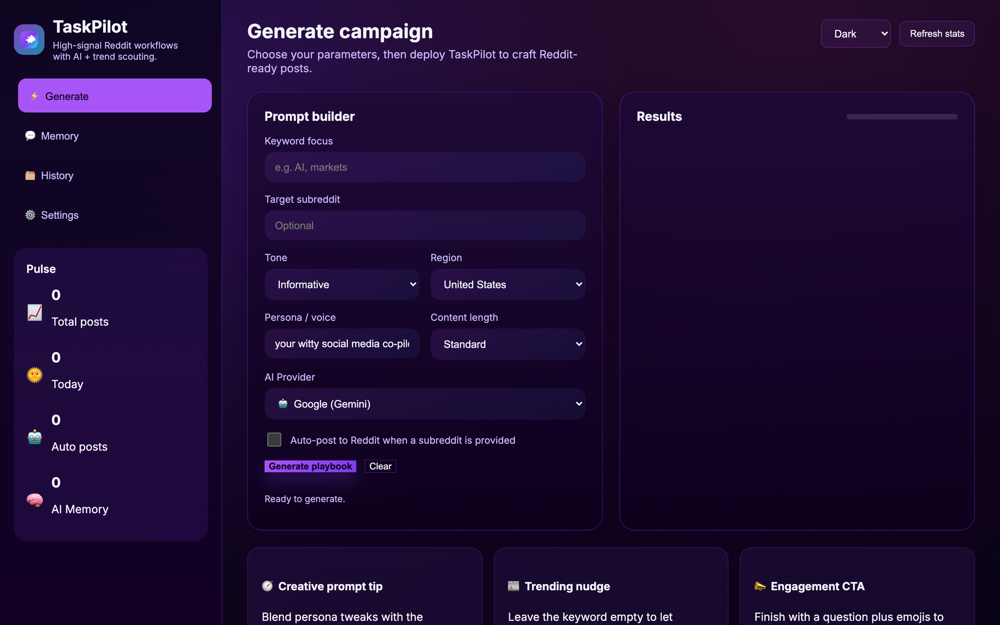

# TaskPilot – Web Edition

TaskPilot now ships as a local-first web application with a FastAPI backend and a modern client-side dashboard. It keeps the original mission—automated Reddit content creation, posting, and analytics—while adding a browser-based experience that you can expose easily on your LAN or through Tailscale.


<p align="center"></p>

---

## ✨ Feature Highlights

| Capability | What it does |
| --- | --- |
| AI Playbooks | Generate multi-paragraph Reddit post drafts with persona-aware prompts powered by Groq. |
| Trend Scout | Pull daily Google Trends and Bing News topics for the region you care about. |
| Auto Posting | Push content straight to Reddit with PRAW when credentials are provided. |
| Engagement Pulse | Track upvotes/comments, export daily summaries, and keep CSV history locally. |
| Tailscale-friendly | Run on `0.0.0.0` so your Tailscale network can reach the dashboard securely. |

---

## 🏗️ Architecture

```
Taskpilot/
├── backend/
│   ├── main.py               # FastAPI application + API routes
│   ├── config.py             # Config loader/saver against taskpilot_config.ini
│   ├── database.py           # SQLite helpers and logging
│   ├── models.py             # Pydantic request/response schemas
│   ├── constants.py          # Shared constants (regions, defaults, etc.)
│   ├── services/             # Groq, Reddit, and topic-fetching helpers
│   └── requirements.txt      # Backend dependencies
├── frontend/
│   ├── index.html            # Single-page dashboard
│   └── assets/
│       ├── styles.css        # Modern glassmorphism-inspired styling
│       └── app.js            # Fetch logic + UI interactions
├── taskpilot_config.ini      # Persisted Groq + Reddit credentials
├── taskpilot.db              # SQLite datastore for posts
└── README.md
```

---

## ✅ Prerequisites

* Python 3.10+
* Groq API key (chat completion endpoint)
* Reddit script app credentials (client ID/secret or refresh token)
* Node.js **not required** – the frontend is vanilla HTML/CSS/JS served statically by FastAPI

---

## 🚀 Quick Start

```powershell
git clone https://github.com/ZANYANBU/Taskpilot.git
cd Taskpilot

# Backend setup
python -m venv .venv
.venv\Scripts\activate
pip install -r backend\requirements.txt

# Launch API + frontend
uvicorn backend.main:app --reload --host 0.0.0.0 --port 8000
```

Open <http://localhost:8000> (or the machine’s Tailscale/VPN address) to use the dashboard.

---

## 🔐 Configuration

Navigate to **Settings → Integrations** in the UI and add your Groq API key plus Reddit credentials. Values are saved to `taskpilot_config.ini` in the repository root. Revisit this form any time to rotate secrets.

### Creating a Reddit “personal use script”

1. Visit <https://old.reddit.com/prefs/apps> and click **create another app…**.
2. Pick **script** as the type, then supply a short name and description.
3. Set the redirect URI to `http://localhost:8080` (or the value in `backend/constants.py`).
4. Copy the generated **client ID** (the 14-character string under the app name) and **client secret**.
5. Back in TaskPilot’s **Settings → Reddit OAuth**, paste the client ID, secret, username, password (or refresh token), and user-agent.

Once saved, TaskPilot validates the credentials automatically so the Reddit integration is ready for auto-posting or engagement sync.

---

## 🔁 Typical Workflow

1. Head to the **Generate** view and pick keyword, persona, tone, and length.
2. Toggle auto-post if you want immediate Reddit submissions.
3. Click **Generate playbook** to receive multi-paragraph drafts (and links if auto-posted).
4. Use the **History** view to sync engagement, download a daily summary, or export CSV.

All posts are logged in `taskpilot.db` so you can restart the server without losing history.

---

## 🌐 Serving over Tailscale

1. Start the FastAPI server with `--host 0.0.0.0` (already shown above).
2. Ensure the machine is connected to Tailscale.
3. Access the app via `http://<tailscale-ip>:8000` from any device on your tailnet.

Because credentials remain on your host, we recommend restricting access to authenticated tailnet members only.

---

## 🛠️ Useful Commands

```powershell
# Refresh Reddit engagement stats manually
Invoke-WebRequest -Method POST http://localhost:8000/api/refresh

# Download today’s summary
Invoke-WebRequest http://localhost:8000/api/summary?format=txt -OutFile summary.txt
```

---

## 🤝 Contributing

Issues and pull requests are welcome! Ideas for roadmap:

* Websocket progress streaming while Groq drafts generate
* Authentication + multi-user workspaces
* Additional trend sources (Reddit hot topics, Twitter/X, etc.)

---

## 📝 License

TaskPilot is released under the [MIT License](LICENSE).

